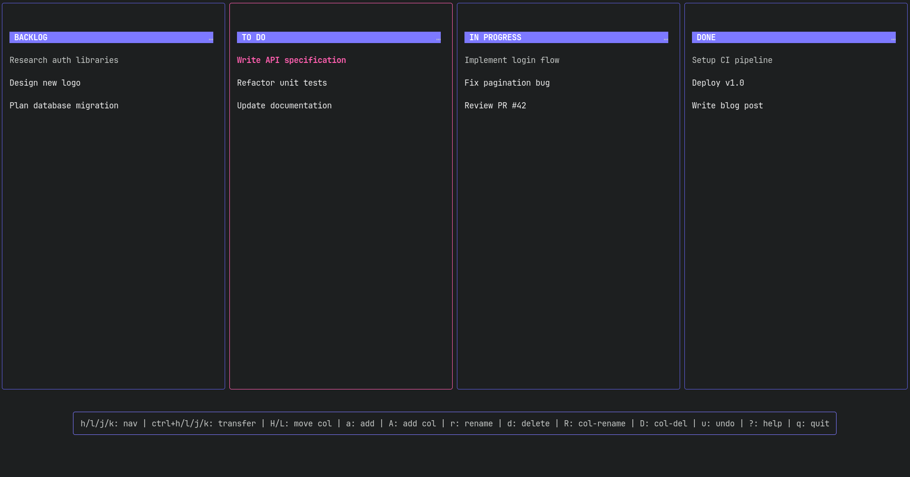

# Goban Board



Minimalist and basic vim-inspired terminal Kanban board. Navigate everything with `hjkl` — no mouse needed. Built with [Bubbletea](https://github.com/charmbracelet/bubbletea), [Lipgloss](https://github.com/charmbracelet/lipgloss), and [SQLite](https://modernc.org/sqlite).

## Features

- Vim-style navigation (`hjkl`)
- Add, rename, and delete tasks
- Move tasks between columns
- Reorder tasks within columns
- Add, rename, delete, and reorder columns
- Undo task deletion
- Persistent storage via SQLite
- Pure Go — no CGO required
- Single binary, minimal dependencies

## Installation

### Via `go install`

```bash
go install github.com/FatihYalcinkaya/Goban-Board@latest
```

### From source

```bash
git clone https://github.com/FatihYalcinkaya/Goban-Board.git
cd Goban-Board
go build -o go-kanban .
./go-kanban
```

## Usage

### Keybindings (vim-style)

| Key | Action |
|---|---|
| `h` / `l` | Navigate columns left/right |
| `j` / `k` | Navigate tasks within a column |
| `a` | Add new task |
| `r` | Rename selected task |
| `d` | Delete selected task (with confirmation) |
| `ctrl+h` / `ctrl+l` | Move task to left/right column |
| `ctrl+j` / `ctrl+k` | Reorder task up/down within column |
| `A` | Add new column |
| `H` / `L` | Move focused column left/right |
| `R` | Rename focused column |
| `D` | Delete focused column (with confirmation) |
| `/` | Search/filter tasks in focused column |
| `u` | Undo last deletion |
| `?` | Toggle help screen |
| `q` / `ctrl+c` | Quit |

## Configuration

Set the `KANBAN_DB_PATH` environment variable to customize the database file location:

```bash
export KANBAN_DB_PATH=/path/to/custom.db
./go-kanban
```

Defaults to `~/.config/goban board/tasks.db`.

## License

MIT — see [LICENSE](./LICENSE).
